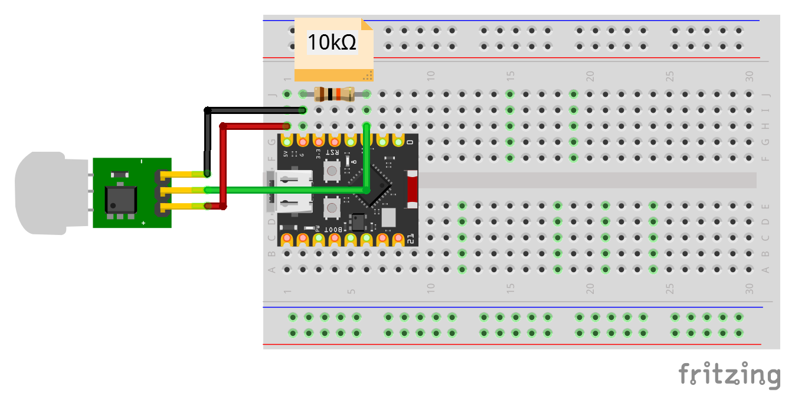

# AM312 - PIR Motion Sensor

The **AM312** is a passive infrared (PIR) motion sensor
supported by the `tosca-drivers` crate via the `am312` feature.

## Wiring

The following diagram shows how to connect an AM312 sensor to an ESP32-C3 board.



| AM312 Pin  | ESP32-C3 Pin |
|------------|--------------|
| VCC        | 3.3/5V       |
| GND        | GND          |
| OUT        | Any GPIO     |

A 10kΩ pull-down resistor is typically required between **OUT** and **GND**.

## Usage

Enable the AM312 driver in your `Cargo.toml`:

```toml
[dependencies]
tosca-drivers = { version = "0.1.0", features = ["am312"] }
